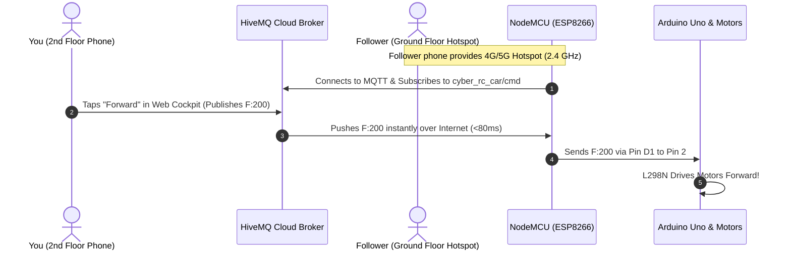

# 🌐 CYBER-RC // TRUE IOT (MQTT CLOUD) SETUP GUIDE

This guide explains how to configure and demonstrate your RC car so you can control it from the **2nd floor** while the car is on the **ground floor**—satisfying your professor's requirement for a **True IoT-based vehicle**.

---

## 🏗️ How the IoT System Works



---

## 🛠️ Step 1: Install `PubSubClient` in Arduino IDE

1. Open **Arduino IDE**.
2. Go to **Sketch** $\rightarrow$ **Include Library** $\rightarrow$ **Manage Libraries...**
3. In the search box, type: `PubSubClient`
4. Find **PubSubClient by Nick O'Leary** and click **Install**.

---

## 📱 Step 2: Configure Follower's Android Phone (Ground Floor)

Your follower's phone acts as the mobile internet gateway traveling with the car.

1. On the Follower's Android phone, open **Settings** $\rightarrow$ **Hotspot & Tethering** $\rightarrow$ **Wi-Fi Hotspot**.
2. **CRITICAL SETTING:** Ensure **AP Band** is set to **2.4 GHz Band** *(NodeMCU ESP8266 does not support 5 GHz)*.
3. Turn **Mobile Data (4G/5G)** ON.
4. Turn the **Mobile Hotspot** ON.
5. Take note of the exact **Hotspot Name (SSID)** and **Password**.

---

## 💻 Step 3: Configure and Upload `NodeMCU_IoT_Bridge.ino`

1. Open `NodeMCU_IoT_Bridge/NodeMCU_IoT_Bridge.ino` in Arduino IDE.
2. In the top configuration section (lines 35–45), update the credentials:
   ```cpp
   // Set to your follower's Android Hotspot name & password
   const char* WIFI_SSID = "YourFollowerHotspotName";
   const char* WIFI_PASS = "YourHotspotPassword";

   // Keep standard HiveMQ public broker
   const char* MQTT_BROKER = "broker.hivemq.com";
   const int   MQTT_PORT   = 1883;

   // Choose your unique topic name (keep matching in Web Cockpit)
   const char* TOPIC_CMD    = "cyber_rc_car/cmd";
   const char* TOPIC_STATUS = "cyber_rc_car/status";
   ```
3. Connect your **NodeMCU** to your computer via micro-USB.
4. Select board: **NodeMCU 1.0 (ESP-12E Module)** and the correct COM Port.
5. Click **Upload**.
6. Open the **Serial Monitor** at **115200 baud**:
   * You should see dots while connecting to the hotspot.
   * Once connected, it will show: `[WIFI]: Connected! IP assigned by Hotspot:`
   * Then: `[MQTT]: Connecting to HiveMQ Cloud Broker... CONNECTED!`
   * The onboard blue LED on NodeMCU will stay **solid ON**, signaling an active cloud link!

---

## 🌐 Step 4: Open the Web Cockpit on Your Phone (2nd Floor)

You have two easy ways to open your web cockpit on the 2nd floor:

### Option A: Free GitHub Pages (Best & Most Impressive for Professors)
1. Push your project or upload the `web_controller` folder files (`index.html`, `style.css`, `app.js`) to a GitHub repository.
2. Go to **Settings** $\rightarrow$ **Pages** $\rightarrow$ select `main` branch $\rightarrow$ click **Save**.
3. You will get a live HTTPS URL like: `https://yourusername.github.io/rc-car/web_controller/`
4. Open that URL on your Android phone on the 2nd floor (works over your own Mobile Data or school Wi-Fi).

### Option B: Local Browser on Phone / Laptop
1. If your phone or laptop is on the same network or you have the files on your phone, open `index.html`.
2. The cockpit will automatically connect to `wss://broker.hivemq.com:8884/mqtt` over the internet!
3. The badge in the top right will display: **`CLOUD READY`**.

---

## 🎓 Step 5: How to Present and Ace the Demo with Your Professor

When your professor asks you to demonstrate:

1. **Explain the Architecture:**
   > *"Professor, previously the car was just using a local Wi-Fi access point, which is why the signal was blocked by the concrete floors. We have now upgraded it to a true **Cloud-based IoT system using the MQTT protocol**."*
2. **Show the Separation of Networks:**
   > *"Notice that my phone up here on the 2nd floor is using my cellular data. The car on the ground floor is connected to the internet through our mobile gateway hotspot."*
3. **Show Real-Time Cloud Telemetry:**
   > *"When I press a button on my web cockpit, the command publishes through the **HiveMQ MQTT Cloud Broker** in milliseconds. The car subscribes to the topic, passes the command to the Arduino Uno, and responds with live ping feedback."*
4. **Trigger the Motion:**
   * Drive Forward, Reverse, Spin, or test the Horn and E-Brake.
   * Watch the telemetry update live on your screen from across the building!

---

## 🔍 Troubleshooting Checklist

* **Hotspot Band:** Make sure the follower's phone hotspot is set to **2.4 GHz**, not 5 GHz.
* **Topic Mismatch:** Ensure the topic in `NodeMCU_IoT_Bridge.ino` (`cyber_rc_car/cmd`) matches the topic inside the Cockpit Settings modal.
* **Arduino Uno Baud Rate:** Ensure SoftwareSerial baud rate is `9600` on both microcontrollers.
* **Common Ground:** Arduino Uno GND **must** be connected to NodeMCU GND and L298N GND.
